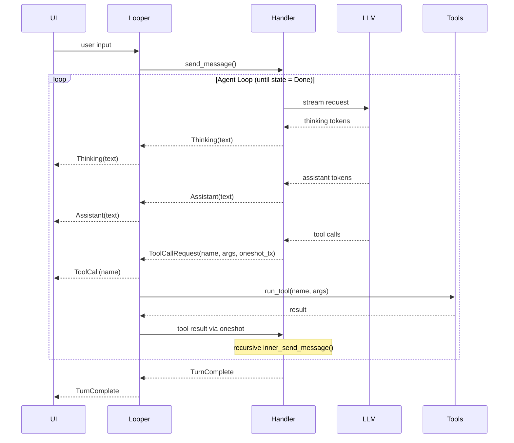

# looper-rs

## Demo

[Demo video (MP4)](./assets/Demo.mp4)

A lightweight, barebones agentic loop that can be plugged into any chat interface (CLI, web, desktop, etc).

The purpose of this is to avoid needing Claude Code/Codex CLI subprocesses per user chat session, which can become unscalable with even a few dozen sessions.

This tool is *not* meant to be as robust as Claude Code/Codex. It's meant to be a lighter weight, more practical solution to their heavy SDKs.

## Features

- Clear separation of concerns between the UI and the agentic loop and handlers
- Agentic loop with tool use (read/write files, grep, find, list directory)
- UI event stream (assistant messages, thinking, tool usage)
- Dynamic tool injection

## Architecture



## Setup

```sh
cat > .env <<EOF
OPENAI_API_KEY=your_api_key_here
LOOPER_API_MODE=responses
LOOPER_MODEL=gpt-5.2
EOF
```

## Usage

```sh
cargo run
```

## Documentation

Full documentation is in [`/docs`](./docs/README.md), organized by concern:

- Getting started and configuration
- Architecture and message flow
- Handler implementations
- Built-in tools and extension guides
