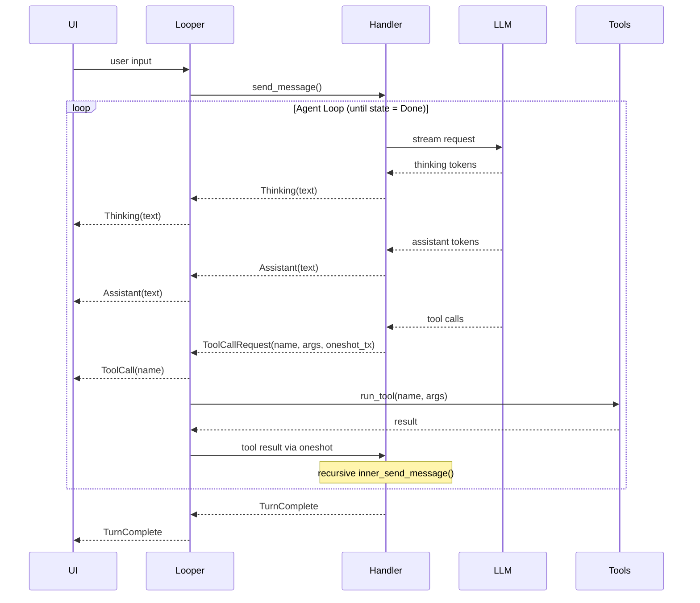

# looper-rs

## Demo

[Demo video (MP4)](./assets/Demo.mp4)

A very barebones, lightweight, agentic loop made to be plugged into any UI chat interface (CLI, web, desktop, etc).

The purpose of this is to avoid having to us Claude Code/Codex CLI which require sub processes of themselves to be spawned per user chat session. This become unscalable quickly with even just a few dozen sessions.

This tool is *not* meant to be as robust as Claude Code/Codex. It's meant to be a lighter weight, more practical solution to their heavy SDKs.

## Features

- Clear separation of concerns between the UI and the agentic loop and handlers
- Agentic loop with tool use (read/write files, grep, find, list directory)
- UI event stream (assistant messages, thinking, tool usage)
- Dynamic tool injection

## Usage

### Non-Streaming

Returns the complete response after the agent loop finishes. Good for background tasks or when you don't need live output.

```rust
let mut looper = Looper::builder(Handlers::OpenAIResponses("gpt-5.4"))
    .instructions("Be helpful.")
    .build().await?;

let result = looper.send("What files are in this directory?").await?;
println!("{}", result.final_text.unwrap());
```

### Streaming

Forwards events (text deltas, thinking, tool calls) over an `mpsc` channel as they arrive. Wire up the receiver to your UI.

```rust
let (tx, mut rx) = mpsc::channel(10000);

let mut looper = LooperStream::builder(Handlers::Anthropic("claude-sonnet-4-20250514"))
    .tools(tools)
    .interface_sender(tx)
    .instructions("Be helpful.")
    .build().await?;

// consume events in a separate task
tokio::spawn(async move {
    while let Some(msg) = rx.recv().await {
        match msg {
            LooperToInterfaceMessage::Assistant(text) => print!("{text}"),
            LooperToInterfaceMessage::Thinking(text)  => print!("{text}"),
            LooperToInterfaceMessage::ToolCall(name)   => println!("[tool: {name}]"),
            LooperToInterfaceMessage::TurnComplete     => println!("\n---"),
            _ => {}
        }
    }
});

looper.send("Read the README").await?;
```

### Builder Options

Both `Looper` and `LooperStream` share these builder methods:

| Method | Description |
|---|---|
| `.tools(Box<dyn LooperTools>)` | Register tools the agent can call |
| `.instructions(impl Into<String>)` | Set a system prompt |
| `.sub_agent(Looper)` | Attach a sub-agent (must have the same tools) |
| `.message_history(MessageHistory)` | Resume from prior conversation state |

`LooperStream` also supports:

| Method | Description |
|---|---|
| `.interface_sender(Sender)` | Channel for UI events |
| `.buffered_output()` | Smooth char-by-char text rendering instead of raw deltas |

### Supported Handlers Examples

You can pass in any model text you want. Be aware, that some features are not supported by all models. For example, Haiku models don't support adaptive thinking.

A future TODO here is to provide more options that are "provider and model" aware so that the caller cannot pass in an invalid config.

| Variant | Example model |
|---|---|
| `Handlers::OpenAICompletions(model)` | `"gpt-5.4"` |
| `Handlers::OpenAIResponses(model)` | `"gpt-5.4"` |
| `Handlers::Anthropic(model)` | `"claude-sonnet-4-6"` |


## Architecture



## Setup

```sh
cp .env.example .env
# Add your OPENAI_API_KEY to .env
```


### Running Examples

```sh
cargo run --example cli              # streaming
cargo run --example cli_non_streaming
```
